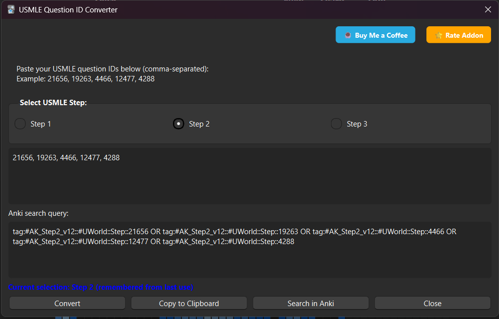
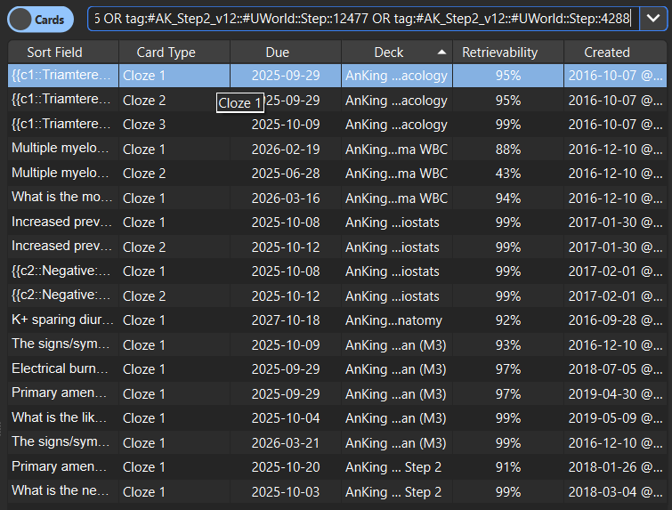

# USMLE Question ID Converter

Convert USMLE question IDs to Anki search queries instantly! Perfect for medical students using UWorld question banks with the **AnKing_v12 deck** from AnkiHub.

## 📺 Demo Video

https://github.com/user-attachments/assets/147e24bd-d391-4760-a06a-459201630bf5

**Complete workflow:** Copy question IDs from USMLEPREPS → Paste in addon → Search in Anki!

## 🚀 Features

- ✅ **Step 1, Step 2 & Step 3 Support** - Choose between USMLE Step 1, Step 2, or Step 3 tags
- ✅ **Smart Memory** - Remembers your last step selection  
- ✅ **Auto-conversion** - Converts IDs as you type
- ✅ **Multiple Actions** - Copy to clipboard or search directly in Anki
- ✅ **Clean Interface** - Simple, intuitive design
- ✅ **Error Handling** - Filters out invalid characters automatically

## 📸 Screenshots

### Main Interface

*Convert multiple question IDs at once - auto-conversion as you type*

### Search Results in Anki

*One-click search opens Anki browser with your target questions*

## ⚠️ Requirements

- **Anki Version**: 2.1.66 or later
- **Deck Required**: [AnKing_v12 deck](https://www.ankihub.net/) (latest version from AnkiHub)
- This addon is specifically designed for the AnKing_v12 tag structure

## 📥 Installation

### Install from AnkiWeb
1. Open Anki → **Tools** → **Add-ons** → **Get Add-ons**
2. Paste this code: **699193084**
3. Restart Anki

## 🔧 Usage

### Quick Start with USMLEPREPS

1. **In USMLEPREPS**: 
   - Go to "My Tests"
   - Click the 3-dot menu (⋮) on your test
   - Select "Share Test"
   - Click "Copy All IDs"

2. **In Anki**:
   - Open: Tools → USMLE Question ID Converter
   - Select your step (Step 1, 2, or 3)
   - Paste the IDs (Ctrl+V / Cmd+V)
   - Click "Search in Anki"
   - Done! 🎉

### Manual Usage

1. **Open the converter**: Tools → USMLE Question ID Converter
2. **Select your step**: Choose Step 1, Step 2, or Step 3 (saved for next time)
3. **Paste question IDs**: Enter comma-separated IDs from your study platform
4. **Get results**: Copy the search query or search directly in Anki

### Example
**Input:** `21656, 19263, 4466, 12477`

**Step 2 Output:**
tag:#AK_Step2_v12::#UWorld::Step::21656 OR tag:#AK_Step2_v12::#UWorld::Step::19263 OR tag:#AK_Step2_v12::#UWorld::Step::4466 OR tag:#AK_Step2_v12::#UWorld::Step::12477

**Step 3 Output:**
tag:#AK_Step3_v12::#UWorld::21656 OR tag:#AK_Step3_v12::#UWorld::19263 OR tag:#AK_Step3_v12::#UWorld::4466 OR tag:#AK_Step3_v12::#UWorld::12477

## 🎯 Perfect For

- Medical students using the **AnKing_v12** deck
- **USMLEPREPS** users who want quick Anki integration
- **UWorld** question bank review
- **Step 1, Step 2, and Step 3** preparation
- Quick access to specific question cards in Anki

## 🐛 Bug Reports & Feature Requests

Found a bug or have a suggestion? Please [open an issue](https://github.com/abdmohrat/usmle-question-id-converter/issues)!

## 📝 Changelog

### v1.1.1 (Latest)
- 🐛 Fixed Rate Addon button not opening review page
- 🎨 Moved support buttons to top-right corner for better layout
- 📏 Increased button widths to prevent text cutoff
- 📐 Improved dialog size (800x480) for better spacing

### v1.1.0
- ✨ Added Step 3 support
- 🎯 Now supports all three USMLE steps
- 💾 Remembers Step 3 selection

### v1.0.2
- 🎨 Redesigned support button: "☕ Buy Me a Coffee"
- ⭐ Added "Rate Addon" button
- ✨ Beautiful hover and press effects on buttons
- 🐛 Fixed support button not opening browser

### v1.0.1
- ✨ Added Ko-fi support button
- 🎨 Improved dialog layout
- 💙 Support development directly from addon

### v1.0.0 (Initial Release)
- 🚀 Convert question IDs to Anki search queries
- ⚡ Support for Step 1 and Step 2
- 💾 Memory feature for step selection
- ⌨️ Auto-conversion as you type
- 📋 Copy to clipboard functionality
- 🔍 Direct Anki search integration

## 📄 License

This project is open source and available under the [MIT License](LICENSE).

## 🤝 Contributing

Contributions are welcome! Feel free to:
1. Fork the repository
2. Create a feature branch
3. Submit a pull request

## 💝 Support

If this addon helped you with your USMLE studies, consider:
- ⭐ **Starring this repository**
- 📝 **[Rating it on AnkiWeb](https://ankiweb.net/shared/review/699193084)**
- ☕ **[Buying me a coffee](https://ko-fi.com/abdmohrat)** to support development
- 🐛 **Reporting bugs or suggesting features**
- 📢 **Sharing with fellow medical students**

---

*Made with ❤️ for the medical student community*
