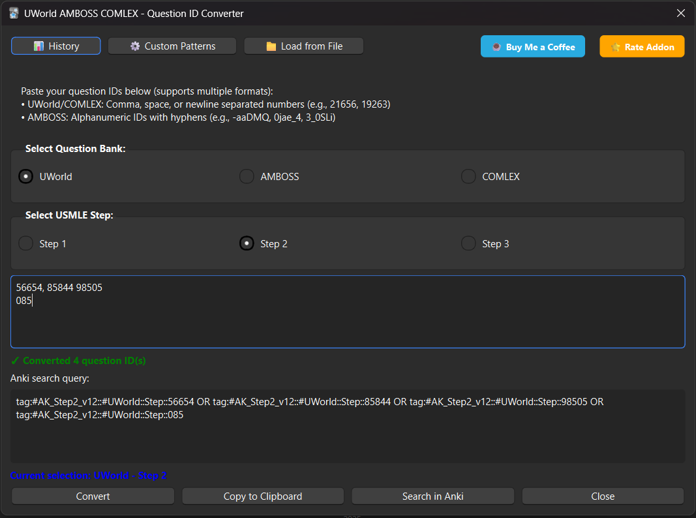

# UWorld AMBOSS COMLEX - Question ID Converter

[](https://ankiweb.net/shared/info/699193084)
[](https://opensource.org/licenses/MIT)
[](https://github.com/abdmohrat/usmle-question-id-converter/releases)
[](https://ko-fi.com/abdmohrat)

Convert question IDs from **UWorld**, **AMBOSS**, and **COMLEX** to Anki search queries instantly! Perfect for medical students using the **AnKing_v12 deck** from AnkiHub. Also supports USMLEPREPS, Coursology, and other question banks via custom patterns.

## 📺 Demo Video

https://github.com/user-attachments/assets/f5e05a6e-26f7-430f-abbb-bb31ece9b53c

**Complete workflow:** Copy question IDs from your question bank → Paste in addon → Search in Anki!

## 🎉 What's New in v1.3.0

### Multi-Question Bank Support!

- 🏥 **UWorld Support** - Full Step 1, 2, and 3 coverage
- 🎓 **AMBOSS Support** - Step 1 and 2 with alphanumeric IDs
- 🏥 **COMLEX Support** - Step 1 and 2 for osteopathic medicine
- 🔄 **Smart Bank Detection** - Automatically handles different ID formats
- 💾 **Bank Memory** - Remembers your last selected question bank
- ⚙️ **Custom Patterns** - Support for USMLEPREPS, Coursology, and any deck!

## 🚀 Features

### Core Features
- ✅ **3 Question Banks** - UWorld, AMBOSS, and COMLEX built-in
- ✅ **Step 1, 2 & 3 Support** - Full USMLE step coverage (where available)
- ✅ **Smart ID Recognition** - Handles numeric (UWorld/COMLEX) and alphanumeric (AMBOSS) IDs
- ✅ **Smart Memory** - Remembers your last bank and step selection  
- ✅ **Auto-conversion** - Converts IDs as you type
- ✅ **Multiple Actions** - Copy to clipboard or search directly in Anki
- ✅ **Clean Interface** - Simple, intuitive design
- ✅ **Error Handling** - Filters out invalid characters automatically

### Advanced Features (v1.2.0+)
- 📁 **File Import** - Load IDs from .txt or .csv files for batch processing
- 🎯 **Browser Context Menu** - Right-click on question bank cards to extract IDs
- ⚙️ **Custom Tag Patterns** - Configure for USMLEPREPS, Coursology, or any deck!
- 🔄 **Flexible Input** - Paste IDs in any format: comma, space, newline, or tab-separated
- 📊 **Conversion History** - Track your last 20 conversions with dates and counts
- 📈 **Live Stats** - See ID count in real-time as you type
- ✨ **Enhanced UI** - Larger dialog (850x600) with better visual feedback
- 🎨 **Dark Mode Support** - Perfect visibility in both light and dark themes 

## 📸 Screenshots

### Main Interface

*Convert question IDs from UWorld, AMBOSS, or COMLEX*

### Search Results in Anki

*One-click search opens Anki browser with your target questions*

## ⚠️ Requirements

- **Anki Version**: 2.1.66 or later
- **Deck**: Works with [AnKing_v12 deck](https://www.ankihub.net/) by default
- **Custom Decks**: Configure your own tag patterns for any deck!

## 📥 Installation

### Install from AnkiWeb
1. Open Anki → **Tools** → **Add-ons** → **Get Add-ons**
2. Paste this code: **699193084**
3. Restart Anki

## 🔧 Usage

### Quick Start with Question Banks

#### UWorld
1. Copy your question IDs (numeric format: 21656, 19263, 4466)
2. Open: Tools → UWorld AMBOSS COMLEX - Question ID Converter
3. Select "UWorld" and your step
4. Paste the IDs
5. Click "Search in Anki" - Done! 🎉

#### AMBOSS
1. Copy your AMBOSS IDs (alphanumeric: -aaDMQ, 0jae_4, 3_0SLi)
2. Open the converter
3. Select "AMBOSS" and your step (1 or 2)
4. Paste the IDs
5. Click "Search in Anki" - Done! 🎉

#### COMLEX
1. Copy your COMLEX question IDs (numeric: 106228, 100004)
2. Open the converter
3. Select "COMLEX" and your step (1 or 2)
4. Paste the IDs
5. Click "Search in Anki" - Done! 🎉

### USMLEPREPS Integration

**In USMLEPREPS**: 
- Go to "My Tests"
- Click the 3-dot menu (⋮) on your test
- Select "Share Test"
- Click "Copy All IDs"

**In Anki**:
- Open the converter
- Select UWorld (USMLEPREPS uses UWorld format)
- Paste and search!

### Manual Usage

1. **Open the converter**: Tools → UWorld AMBOSS COMLEX - Question ID Converter
2. **Select your question bank**: UWorld, AMBOSS, or COMLEX
3. **Select your step**: Choose Step 1, 2, or 3 (saved for next time)
4. **Input IDs** (choose one):
   - Paste directly (comma, space, or newline-separated)
   - Click "📁 Load from File" to import from .txt or .csv
5. **Get results**: Copy the search query or search directly in Anki

### Input Format Examples

The addon accepts **any format**:

**UWorld/COMLEX (numeric):**
```
Comma-separated:    21656, 19263, 4466
Space-separated:    21656 19263 4466
Newline-separated:  21656
                    19263
                    4466
Mixed format:       21656, 19263
                    4466
```

**AMBOSS (alphanumeric):**
```
Comma-separated:    -aaDMQ, 0jae_4, 3_0SLi
Space-separated:    -aaDMQ 0jae_4 3_0SLi
Newline-separated:  -aaDMQ
                    0jae_4
                    3_0SLi
```

All formats work perfectly! 🎉

### Output Examples

**UWorld Step 2:**
```
tag:#AK_Step2_v12::#UWorld::Step::21656 OR tag:#AK_Step2_v12::#UWorld::Step::19263
```

**AMBOSS Step 1:**
```
tag:#AK_Step1_v12::#AMBOSS::-aaDMQ OR tag:#AK_Step1_v12::#AMBOSS::0jae_4
```

**COMLEX Step 1:**
```
tag:#AK_Step1_v12::#UWorld::COMLEX::106228 OR tag:#AK_Step1_v12::#UWorld::COMLEX::100004
```

**UWorld Step 3:**
```
tag:#AK_Step3_v12::#UWorld::21656 OR tag:#AK_Step3_v12::#UWorld::19263
```

### Custom Patterns for Other Question Banks

Want to use with any other deck?

1. Click "⚙️ Custom Patterns"
2. Select the appropriate bank tab
3. Define your pattern: `tag:#YourDeck::#YourBank::{ID}`
4. Test with a sample ID
5. Save and use!

## 🎯 Perfect For

- **UWorld** users preparing for USMLE Steps 1, 2, 3
- **AMBOSS** users studying for Step 1 and 2
- **COMLEX** students using UWorld question bank
- **USMLEPREPS** users who want quick Anki integration
- **Coursology** and other question bank users (via custom patterns)
- Medical students using the **AnKing_v12** deck
- **Batch processing** weekly review lists
- Quick access to specific question cards in Anki

## 🐛 Bug Reports & Feature Requests

Found a bug or have a suggestion? Please [open an issue](https://github.com/abdmohrat/usmle-question-id-converter/issues)!

## 📝 Changelog

### v1.3.0 (Latest - October 2025)
- 🏥 **Multi-Bank Support**: Added AMBOSS and COMLEX support
- 🔄 **Smart ID Detection**: Handles both numeric and alphanumeric IDs
- 💾 **Bank Memory**: Remembers last selected question bank
- 🎯 **Dynamic UI**: Step 3 auto-disables for AMBOSS/COMLEX
- ⚙️ **Enhanced Custom Patterns**: Bank-specific pattern configuration
- 📊 **History Update**: Added bank column to conversion history
- 🔍 **Browser Integration**: Extracts IDs from all supported banks
- ✨ **Better Title**: Renamed to emphasize multi-bank support

### v1.2.1
- 🎨 Fixed Custom Patterns test result visibility in dark mode
- ✨ Test result box now adapts to Anki's theme automatically

### v1.2.0 (Major Update)
- 🎉 **Batch Processing**: Load question IDs from text/CSV files
- 📋 **Quick Actions**: Right-click cards in browser to extract question IDs
- ⚙️ **Custom Patterns**: Define your own tag patterns for any deck
- 🧠 **Smart Input**: Accepts IDs in any format (comma, space, newline, tab)
- 📊 **History Tracker**: View your last 20 conversions with timestamps
- ✨ **Better UI**: Live ID counter, status messages, improved layout
- 🚀 **Dialog Size**: Increased to 850x600 for better workflow

### v1.1.1
- 🐛 Fixed Rate Addon button
- 🎨 Improved layout

### v1.1.0
- ✨ Added Step 3 support

### v1.0.2
- 🎨 Redesigned support button
- ⭐ Added "Rate Addon" button

### v1.0.1
- ✨ Added Ko-fi support button

### v1.0.0 (Initial Release)
- 🚀 Convert question IDs to Anki search queries
- ⚡ Support for Step 1 and 2
- 💾 Memory feature for step selection

## 📄 License

This project is open source and available under the [MIT License](LICENSE).

## 🤝 Contributing

Contributions are welcome! Feel free to:
1. Fork the repository
2. Create a feature branch
3. Submit a pull request

## 💝 Support

If this addon helped you with your medical studies, consider:
- ⭐ **Starring this repository**
- 📝 **[Rating it on AnkiWeb](https://ankiweb.net/shared/review/699193084)**
- ☕ **[Buying me a coffee](https://ko-fi.com/abdmohrat)** to support development
- 🐛 **Reporting bugs or suggesting features**
- 📢 **Sharing with fellow medical students**

## 🙏 Acknowledgments

Thanks to:
- The AnKing team for their amazing AnKing_v12 deck
- UWorld, AMBOSS, and COMLEX for their excellent question banks
- The medical student community for feedback and support

---

*Made with ❤️ for the medical student community*

**Happy Studying! 📚🩺**
